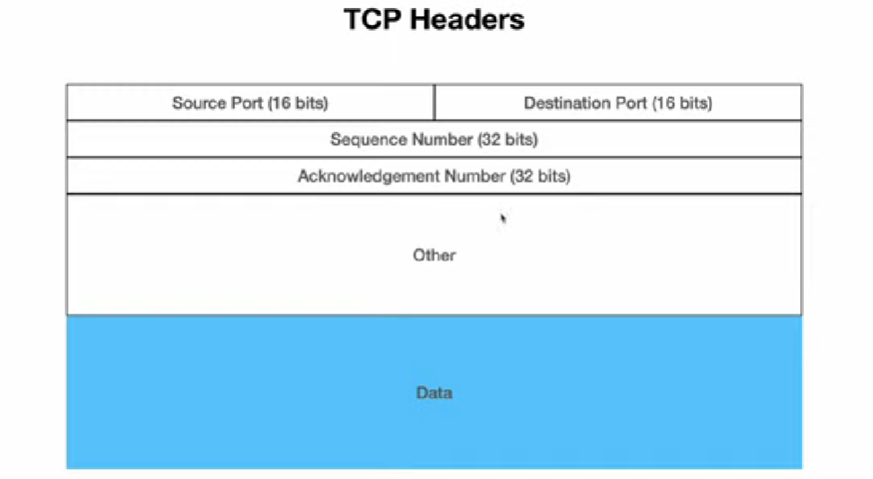
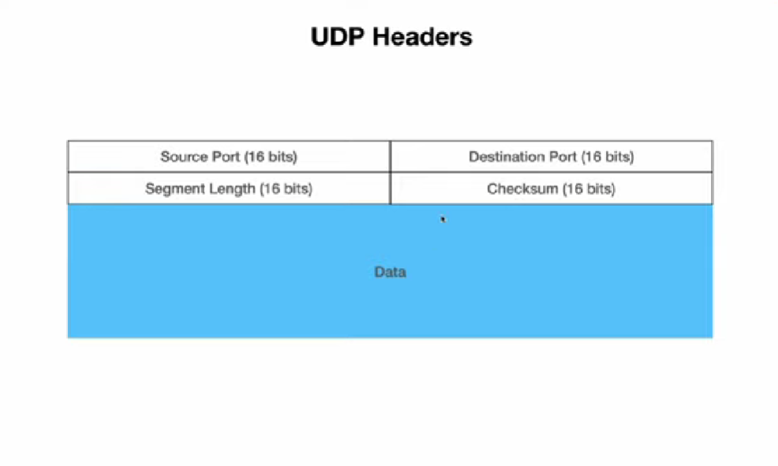

# TCP
Network layer break down the message into packet and send the data works with IP address and it move the data from point A to point B but what if the data got re transmitted and what if the server crashes therefore the TCP protocol comes into picture

## Purpose of TCP
TCP layer has no idea about IP Address it just make sure that the data has received and it will add port to move the data to specific layer. now the name is little bit confusing all the transportion done in network layer. so the name transport layer is because it will add some port number to the packet so that it know which application need to receive that data

Every singal bit that we send TCP will make sure that it receive or it is not change in any shape or form.

Now UDP Doesn't really care about all these stuff it just the message and that's it. so UDP are used in live streaming application, facetime application so UDP is much faster than TCP

Http is build on top of TCP

Now TCP works in three way hand shake 
- 1. Point A send some data to Point B 
- 2. Point B send a acknowledgement to point A that the data receive correct 
- 3. Then Point again send another packet to point B
## TCP Header

- Source Port - Port where the data get send 
- Destination Port - where the data get received 
- Sequence Number - A number assigned to each pakcet 
- Acknowledgement number - Check if the data receive correctly.\
Then We have our data which is optional

Notice there is not IP address or MAC address and the reason is and the reason is each layer add its own header 
so TCP add its own address, Network layer adds its own

## UDP Header 
- Source Port - Port of source 
- Destination Port - Port is Destination
- Segment length - Segment length indicate how big the segment length.
- Checksum - Indicate whether the data is cropped or not
   - Check the binary data all that 0 and 1 and do sum calculation to make sure if the data is cropped. we have checksum in both sender and receiver 

size of UDP is fixed it is 64 Bit